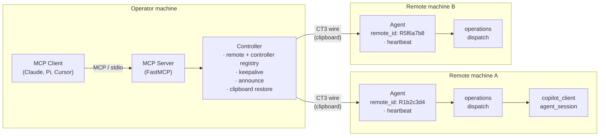
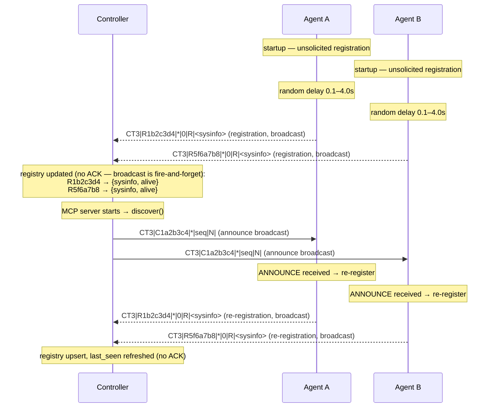
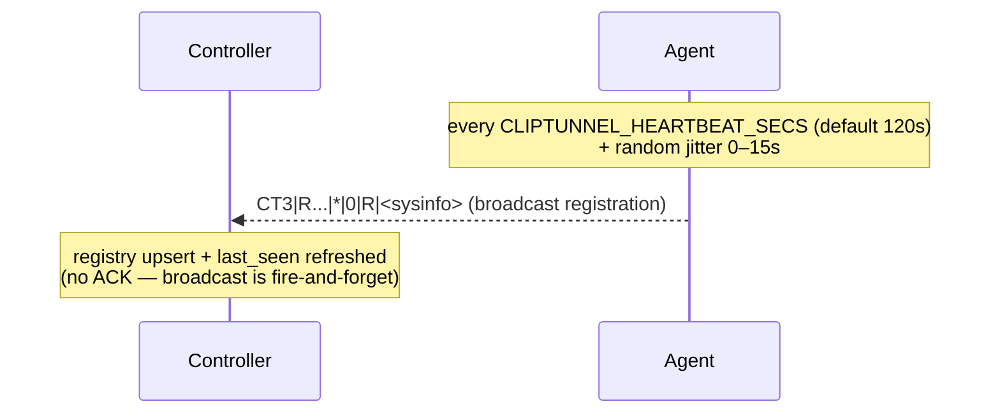
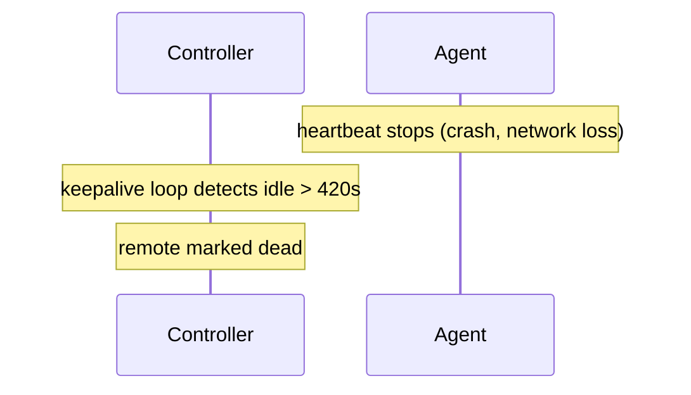

# cliptunnel-mcp

Operate locked-down remote machines through their clipboard, an HTTPS repeater, a WebSocket repeater, or Firebase — with multi-remote support, autonomous agents, clipboard preservation, agent heartbeat, and optional AES-256-GCM encryption.

## What it does

`cliptunnel-mcp` turns a shared clipboard into a reliable control channel between machines. When a remote machine sits behind a Citrix session, a locked-down VDI, or any environment that blocks SSH, file transfer, and networking but still exposes a clipboard, ClipTunnel tunnels commands through that single slot and exposes them as [Model Context Protocol](https://modelcontextprotocol.io) tools.

**v1.0.2** ships the CT3 wire protocol v3 with prefixed endpoint IDs (`C`/`R` + 7 hex), announce-based discovery, multi-controller awareness, an agent heartbeat that keeps the remote roster self-healing, clipboard preservation that restores the user's clipboard after every exchange, four transport options — clipboard (default), HTTPS repeater, WebSocket repeater, and Firebase Realtime Database — optional AES-256-GCM encryption that works with any transport, sanitized transport endpoint reporting in sysinfo, PowerShell shell execution on Windows, error responses that surface the agent's actual error output, and zombie job detection for commands whose clipboard response was lost.

The package ships four layers:

- **Protocol** — CT3 wire format with prefixed endpoint IDs (`C`/`R` + 7 hex), broadcast routing, heartbeat-based keepalive, announce-based discovery, and typed messages (command, response, error, ack, ping, announce). Optional AES-256-GCM encryption at the protocol level (`CT3E|` prefix) encrypts the payload while keeping the header plaintext for routing.
- **Endpoints** — `Controller` (operator side) with a remote + controller registry, and multiple `Agent` instances (remote side), each with a unique prefixed ID. Both run background threads with ARQ retransmission, sequence-bound deduplication, and generation-safe lifecycle.
- **MCP server** — a FastMCP application with 27 tools including shell, filesystem, binary transfer, sysinfo, remote agent management, connection listing, announce-based discovery, and remote install instructions.
- **Transport layer** — clipboard (default, backed by [clipboard-event](https://github.com/jordi-murgo/clipboard-event) with user-clipboard preservation), HTTPS repeater (optional, with bearer auth), WebSocket repeater (optional, local or remote relay), or Firebase Realtime Database (optional, hosted slot with server timestamps). All implement the same `Transport` and `RevisionMonitor` protocols — the Controller and Agent are fully transport-agnostic. Encryption is handled at the protocol level, not the transport level.

## Architecture



On startup each Agent generates a random prefixed ID (`R` + 7 hex), waits a random delay (0.1–4.0s), and sends its sysinfo as a registration response to the broadcast address — no Controller announce needed. The Controller announces later when the MCP server starts (or when `discover()` is called), which triggers agents to re-register. The Controller maintains a registry of all connected remotes and any other controllers it discovers. A keepalive thread marks remotes `dead` if no heartbeat is received within ~420s (3.5× the default heartbeat interval) — no pings are sent. Each Agent additionally runs a **heartbeat** thread that periodically re-sends its registration, so a lost announce response never leaves an agent invisible. After every exchange the Controller **restores the user's clipboard** content that was present before the protocol traffic (clipboard transport only — network transports do not touch the user's clipboard). The Agent also restores the user's clipboard after each registration, since registrations are fire-and-forget.

### Wire format

```
CT3|<from>|<to>|<seq>|<type>|<payload>        (plaintext)
CT3E|<from>|<to>|<seq>|<type>|<payload>      (encrypted payload)
```

| Field    | Value                                                                |
|----------|----------------------------------------------------------------------|
| `CT3`/`CT3E` | Protocol signature + version. `CT3E` indicates the payload is AES-256-GCM encrypted (header stays plaintext). |
| `from`   | `C` + 7 hex (Controller) or `R` + 7 hex (remote ID, e.g. `R1b2c3d4`) |
| `to`     | `C` + 7 hex (Controller), `*` (broadcast), or `R` + 7 hex (specific remote) |
| `seq`    | Positive integer, monotonic per session (`0` = registration/heartbeat) |
| `type`   | `C` (command), `R` (response), `E` (error), `A` (ack), `P` (ping), `N` (announce) |
| `payload`| Base64-encoded UTF-8 (plaintext mode) or base64-encoded AES-256-GCM ciphertext (encrypted mode) |

### Registration and announce flow

The Agent registers on startup without waiting for a Controller announce, and re-registers whenever it receives an ANNOUNCE from any Controller. The Controller announces when the MCP server starts (or when `discover()` is called manually).



The initial registration is directed to the broadcast address (`*`) so all controllers on the shared channel receive it. When a Controller's ANNOUNCE arrives later, the Agent re-registers to ensure visibility. Because the clipboard is a single last-writer-wins slot, simultaneous registrations can collide and one agent's registration may be lost. The heartbeat below makes this self-healing: the missing agent re-registers on the next cycle.

### Heartbeat



Each Agent runs a daemon thread that re-sends its registration (a `RESPONSE` with `seq=0` carrying `sysinfo`) as a single broadcast to `*` on a configurable interval plus jitter, so every known controller on the shared channel receives it. The jitter prevents multiple agents sharing a channel from synchronizing their writes. A lost heartbeat is harmless — the next one arrives. The controller's existing registration upsert path consumes it with no protocol or controller changes, and no ACK is sent for broadcast registrations.

| Setting | Default | Effect |
|---------|---------|--------|
| `CLIPTUNNEL_HEARTBEAT_SECS` env var | `120` | Interval in seconds. `<= 0` disables the heartbeat. |
| `Agent(heartbeat_secs=...)` | `None` (resolves env var, then config file `[heartbeat] interval_secs`, then default) | Programmatic override of the env var. |

### Keepalive

The keepalive loop monitors the heartbeat-driven `last_seen` timestamp. It does not send pings — instead, it marks a remote `dead` if no heartbeat has been received within a dead threshold (3.5× the heartbeat interval, ~420s by default). Channel-level keepalive (WebSocket ping/pong, SSE) is handled by each transport independently.



With the heartbeat active, the keepalive loop rarely fires — it only marks remotes that have stopped heartbeating for over 7 minutes. A remote that resumes heartbeating is picked up by the registration upsert path and returns to `alive` status.

## Installation

```bash
pip install cliptunnel-mcp          # core + cliptunnel-agent binary
pip install cliptunnel-mcp[server]  # adds MCP server binary (mcp>=1.2,<2)
```

Dependencies: `clipboard-event>=0.2.0` (cross-platform clipboard change notifications), `cryptography>=42` (AES-256-GCM encryption), `websockets>=12.0` (WebSocket transport), plus `tomli` on Python 3.10 only (TOML config file parsing; stdlib from 3.11).

| Binary              | Extra needed | Purpose                                      |
|---------------------|--------------|----------------------------------------------|
| `cliptunnel-agent`  | *(none)*     | Runs the Agent (clipboard, HTTPS, WebSocket, or Firebase transport). |
| `cliptunnel-mcp`    | `[server]`   | Runs the MCP server over stdio.              |

## Quick start

### Agent (remote machine)

```bash
cliptunnel-agent
```

> **Antivirus / EDR workaround (Windows)**: unsigned `.exe` entry points may be quarantined. Use `python -m` instead:
>
> ```bash
> python -m cliptunnel_mcp.agent    # instead of cliptunnel-agent
> python -m cliptunnel_mcp.server   # instead of cliptunnel-mcp
> ```

The Agent generates a random prefixed ID, registers with the Controller by sending its sysinfo, then watches the clipboard (or connects to the repeater / WebSocket repeater / Firebase RTDB if `CLIPTUNNEL_TRANSPORT` is `https`, `websocket`, or `firebase`) for commands. It uses `clipboard-event` for clipboard change detection (event-driven on Windows and Wayland, polling on macOS and X11). A heartbeat thread re-registers every `CLIPTUNNEL_HEARTBEAT_SECS` (default 120s) so the Controller never loses it; set the variable to `0` or a negative value to disable it.

### Controller + MCP server (operator machine)

Configure your MCP client (Claude Desktop, Cursor, Pi, etc.):

```json
{
  "mcpServers": {
    "cliptunnel": {
      "command": "cliptunnel-mcp",
      "args": []
    }
  }
}
```

The server broadcasts an announce on startup, discovers connected remotes and any other controllers, and maintains a live registry with heartbeat-based keepalive. When using the clipboard transport, it restores the user's clipboard content after every exchange.

### Controller only (no MCP)

```python
from cliptunnel_mcp.transport_factory import build_transport
from cliptunnel_mcp import Controller
import json

controller = Controller(transport=build_transport())

# Send to a specific remote
future = controller.send_command(json.dumps({"op": "shell", "cmd": "whoami"}), remote_id="R1b2c3d4")
result = future.result(timeout=30)

# List connected remotes
connections = controller.get_connections()
# {"remotes": {"R1b2c3d4": {"os": "Windows", "status": "alive", "last_seen": 1692634123.4, "last_seen_ago": 0.3, ...}}, "controllers": {...}}
```

### Programmatic Agent

```python
from cliptunnel_mcp.transport_factory import build_transport
from cliptunnel_mcp import Agent
from cliptunnel_mcp.operations import dispatch

agent = Agent(transport=build_transport(), handler=dispatch)
# Agent generates its own remote_id, registers automatically, and heartbeats every 120s.
# Disable the heartbeat with heartbeat_secs=0 (or CLIPTUNNEL_HEARTBEAT_SECS=0).
# Set CLIPTUNNEL_TRANSPORT=https (repeater), =websocket (WS repeater), or =firebase (Firebase RTDB)
# to use a network transport instead of the clipboard.
# Set CLIPTUNNEL_AES_KEY to enable AES-256-GCM encryption on any transport.
```

## MCP tools

The server exposes **27 tools** over stdio. Most tools accept an optional `remote_id` parameter to target a specific remote; if omitted, the Controller picks the first alive remote. The exceptions are `remote_shell_result` (targets a job by `job_id`), `remote_connections`, `remote_discovery`, and `remote_install_instructions`, which are global or job-scoped and do not take `remote_id`.

### Shell & filesystem

| Tool | Description |
|------|-------------|
| `remote_shell` | Execute a shell command; auto-sync (10s) then async with `job_id` polling. |
| `remote_shell_result` | Poll for the result of an async shell command. |
| `remote_fs_read` | Read a file. |
| `remote_fs_write` | Create or overwrite a file (creates parent dirs). |
| `remote_fs_list` | List directory entries. |
| `remote_fs_delete` | Delete a file. |
| `remote_fs_replace` | Search-and-replace in a file (exact-once match). |
| `remote_fs_search` | Regex search in a file. |
| `remote_fs_find` | Glob-find files under a directory. |
| `remote_fs_bin_read` | Read a binary file as base64. |
| `remote_fs_bin_write` | Write base64 content to a binary file. |

### Binary transfer

| Tool | Description |
|------|-------------|
| `remote_upload` | Upload a local file to a remote machine. |
| `remote_download` | Download a remote file to the local machine. |

### System info

| Tool | Description |
|------|-------------|
| `remote_sysinfo` | Return system info: OS, Python, CPU, memory, disk, user, shell, agent auth, clipboard backend, transport backend, and sanitized transport endpoint. |

### Remote agent (Copilot)

| Tool | Description |
|------|-------------|
| `remote_agent_login` | Start GitHub OAuth device flow for Copilot authentication. |
| `remote_agent_login_status` | Poll login state (idle/polling/done/error). |
| `remote_agent_models` | List available Copilot models on the remote. |
| `remote_agent_start` | Create an autonomous agent session (async). |
| `remote_agent_continue` | Send a message to an existing session. |
| `remote_agent_result` | Poll for the async result. |
| `remote_agent_status` | Query session status. |
| `remote_agent_list` | List active agent sessions. |
| `remote_agent_clear` | Clear session message history. |
| `remote_agent_end` | Destroy a session. |

### Connections & discovery

| Tool | Description |
|------|-------------|
| `remote_connections` | List all connected remotes and controllers with sysinfo, `transport_backend`, `transport_endpoint`, `last_seen` (epoch), `last_seen_ago` (seconds), and `status` (alive/dead). |
| `remote_discovery` | Broadcast an ANNOUNCE to discover remotes and other controllers on the shared clipboard, repeater, WebSocket repeater, or Firebase RTDB. |
| `remote_install_instructions` | Return installation instructions for the remote agent based on the controller's active transport (clipboard, HTTPS, WebSocket, or Firebase). Includes env vars, repeater URL, bearer token, WebSocket URL, Firebase URL, and AES key (if configured). |

## Operations

The `dispatch` handler supports these operations:

| Operation | Parameters | Returns |
|-----------|------------|---------|
| `shell` | `cmd` | JSON: `{stdout, stderr, returncode}`. On Windows, prefers PowerShell (pwsh/powershell) and falls back to cmd.exe. |
| `fs.write` | `path`, `content` | `wrote N bytes to PATH` |
| `fs.list` | `path` | JSON: `[{name, size, is_dir}]` |
| `fs.delete` | `path` | `deleted PATH` |
| `fs.replace` | `path`, `old`, `new` | `replaced 1 occurrence in {path}` (exact-once) |
| `fs.search` | `path`, `pattern` | JSON: `[{line, content}]` (regex) |
| `fs.find` | `path`, `pattern` | JSON: `[PATH, ...]` (glob) |
| `fs.bin_read` | `path` | JSON: `{path, size, b64}` |
| `fs.bin_write` | `path`, `b64` | `wrote N bytes to PATH` |
| `sysinfo` | — | JSON: full system info |
| `register` | — | JSON: sysinfo (alias for agent registration) |
| `agent` | `action`, ... | JSON: session management (start, continue, result, status, clear, end, list, login, login_status) |

## Remote agent

The Agent can run autonomous Copilot-powered agents on the remote machine. Each agent session:

- Uses the GitHub Copilot API with function calling (shell, fs_read, fs_write, fs_replace, fs_search, fs_list, fs_find)
- Runs asynchronously in a background thread
- Supports multi-turn conversations with `remote_agent_continue`
- Default model: `mai-code-1.1-flash`

### Authentication

```python
# Via MCP tools:
remote_agent_login()          # Returns user_code + verification_uri
# Open https://github.com/login/device, enter the code
remote_agent_login_status()   # Returns {status: "done", token_saved: true}
```

Token resolution order: the `[copilot].oauth_token` key in the config file (see [Configuration](#configuration)) takes precedence; the legacy `.copilot_agent_token` file on the remote machine is still supported as a fallback. The token lookup for the legacy file is relative to the agent process working directory, so launch the agent from a directory that contains (or can access) the token file.

## API surface

### `Controller`

The operator-side endpoint with remote + controller registry, keepalive, and clipboard restore.

| Method | Description |
|--------|-------------|
| `send_command(command, remote_id=None) -> Future` | Queue a command to a specific remote (or first alive). |
| `send_command_sync(command, remote_id=None) -> str \| None` | Send and block until response or timeout. |
| `get_connections() -> dict` | Return `{"remotes": {...}, "controllers": {...}}` with sysinfo, last_seen, last_seen_ago, and status. |
| `close()` | Stop background threads. Idempotent. |

### `Agent`

The remote-side endpoint with auto-registration, heartbeat, and ping handling.

| Method | Description |
|--------|-------------|
| `close()` | Stop this agent (heartbeat, reader, dispatcher, pool). Idempotent. |
| `send_registration(controller_id=None)` | Send sysinfo to a controller (or all known controllers). Also used by the heartbeat. |

Constructor parameters: `transport` (required), `handler` (required), `poll_interval`, `max_workers`, `response_ack_timeout`, `heartbeat_secs` (default `None` → resolves `CLIPTUNNEL_HEARTBEAT_SECS`, then `120`; `<= 0` disables).

### `ClipboardTransport`

| Method | Description |
|--------|-------------|
| `read() -> str` | Return the current clipboard value (cached, never `None` — empty string when the clipboard is empty). |
| `write(text: str)` | Write to the clipboard as a self-write. |
| `restore_user_clipboard() -> bool` | Guarded restore of the backed-up user content; `True` on success, `False` if the slot was touched by another writer or no backup exists. |

### `HttpsTransport`

| Method | Description |
|--------|-------------|
| `read() -> str` | Return the current cached value (never blocks, never raises). |
| `write(value: str)` | POST to repeater, bump revision, notify waiters. Raises `TransportAuthError` on 401, `TransportError` on other failures. |
| `revision` property | Current revision counter. |
| `wait_for_change(after, timeout) -> int` | Block until revision > after or timeout. Never raises on timeout. |
| `close()` | Stop the SSE daemon thread. Idempotent. |
| `backend_name` property | Returns `"https"`. |
| `endpoint` property | Returns the repeater URL (sanitized, no bearer token). |

Constructor parameters: `repeater_url` (required), `bearer_token` (required), `http_client` (optional, injectable for tests), `sse_reconnect_delay`, `poll_timeout`, `request_timeout`.

### `WebSocketTransport`

Transport + RevisionMonitor backed by a WebSocket repeater using a JSON frame protocol.

| Method | Description |
|--------|-------------|
| `read() -> str` | Return the locally cached slot value. Never blocks. |
| `write(value: str)` | Send a `write` frame and wait for `write_ack`. Raises `TransportAuthError` on auth failure, `TransportError` on timeout or network error. |
| `revision` property | Current revision counter. |
| `wait_for_change(after, timeout) -> int` | Block until `revision > after` or timeout. Never raises on timeout. |
| `close()` | Stop the background loop and close the WS connection. Idempotent. |
| `backend_name` property | Returns `"websocket"`. |
| `endpoint` property | Returns the WebSocket URL (sanitized, no bearer token). |

Constructor parameters: `ws_url` (required), `bearer_token` (required), `poll_timeout`, `reconnect_delay`, `reconnect_max_delay`, `request_timeout`, `ws_client` (optional, injectable for tests).

### `FirebaseTransport`

| Method | Description |
|--------|-------------|
| `read() -> str` | Return the current cached value (never blocks, never raises). |
| `write(value: str)` | PUT the node to Firebase RTDB, adopt the server timestamp as revision, notify waiters. Raises `TransportAuthError` on 401/403, `TransportError` on other failures. |
| `revision` property | Current revision (the node's server timestamp in ms). |
| `wait_for_change(after, timeout) -> int` | Block until revision > after or timeout. Never raises on timeout. |
| `backend_name` property | Returns `"firebase"`. |
| `endpoint` property | Returns the database URL (sanitized, no auth token). |

Constructor parameters: `database_url` (required), `auth_token` (required), `node_path` (default `"cliptunnel"`), `http_client` (optional, injectable for tests), `sse_reconnect_delay`, `request_timeout`.

### `build_transport()` factory

| Function | Description |
| `build_transport() -> Transport` | Resolve `CLIPTUNNEL_TRANSPORT` (env var, or config file `[transport] type`) and return a `ClipboardTransport` (default), `HttpsTransport`, `WebSocketTransport`, or `FirebaseTransport`. Raises `ValueError` on missing required settings or unknown transport. Precedence: env var > config file > default. Encryption is handled at the protocol level when `CLIPTUNNEL_AES_KEY` is set — `build_transport()` does not wrap the transport. |

### `crypto` module

| Function | Description |
|--------|-------------|
| `encrypt(plaintext: str, key: bytes) -> str` | AES-256-GCM encrypt. Returns `base64(nonce[12] ‖ ciphertext+tag)`. |
| `decrypt(blob: str, key: bytes) -> str` | AES-256-GCM decrypt. Raises on tampered tag or wrong key. |
| `parse_key(raw: str) -> bytes` | Parse a base64-encoded 32-byte key from `CLIPTUNNEL_AES_KEY`. Raises `ValueError` on invalid input. |

### Protocol primitives

| Symbol | Description |
|--------|-------------|
| `pack(msg) -> str` | Serialize a `Message` into wire format. |
| `unpack(raw) -> Message \| None` | Parse a wire string; `None` on malformed. |
| `validate(raw, my_id) -> bool` | True if addressed to `my_id` (`C`/`R` + 7 hex) or broadcast. |
| `generate_controller_id() -> str` | Generate `C` + 7 hex. |
| `generate_remote_id() -> str` | Generate `R` + 7 hex. |
| `Message` | Dataclass: `frm`, `to`, `seq`, `mtype`, `payload`. |
| `MsgType` | Enum: `COMMAND`, `RESPONSE`, `ERROR`, `ACK`, `PING`, `ANNOUNCE`. |
| `SeqTracker` | Per-seq dedupe state: new → processing → done. |

## Platform support

| Platform | Status | Clipboard | CI |
|----------|--------|-----------|-----|
| macOS | Tested | clipboard-event (changeCount) | macOS + Linux + Windows × Python 3.10–3.14 |
| Windows | Tested | clipboard-event (WM_CLIPBOARD_UPDATE) | Same |
| Linux / Wayland | Tested | clipboard-event (wl-paste --watch) | Same |
| Linux / X11 | Core works | clipboard-event (xclip polling) | Same |

## Development

```bash
# Create a virtual environment
uv venv && source .venv/bin/activate

# Install in development mode
uv pip install -e . pytest

# Run the test suite (498 tests with both pytest and unittest)
python -m pytest -q
# or
python -m unittest discover -s tests -t .
# Bare mode — no install, just PYTHONPATH
PYTHONPATH=src:. python -m pytest -q
```

The test suite uses a deterministic `ClipboardSlot` test double. No clipboard hardware needed.

## Lifecycle and coalescing semantics

- **One command at a time**: the Controller dispatches commands serially per target remote.
- **Immediate ACK**: the Agent ACKs every command before processing.
- **One response at a time**: the Agent holds one pending response; retransmits until the Controller's ACK.
- **Announce discovery**: the Controller broadcasts an ANNOUNCE when the MCP server starts (or on `remote_discovery`); agents re-register in response. Agents also register unsolicited on startup. Replies can collide on the shared slot; the heartbeat makes this self-healing.
- **Heartbeat**: each Agent re-sends its registration every `CLIPTUNNEL_HEARTBEAT_SECS` (default 120s) + jitter (0–15s); `<= 0` disables. The controller upserts the roster on every heartbeat.
- **Clipboard preservation**: the clipboard transport backs up non-CT3 clipboard content; the Controller restores it (guarded) after the final ACK of every exchange; the Agent restores it after each registration (fire-and-forget, no controller response to clean the slot).
- **Keepalive**: the Controller marks remotes dead if no heartbeat is received within ~420s (3.5× default heartbeat). No pings are sent — the heartbeat is the liveness signal. Channel-level keepalive (WS ping/pong, SSE) is per-transport.
- **Targeted routing**: `to=<R+7hex>` messages are processed only by that remote; others ignore.
- **Stale message guard**: the Controller skips R/E with `seq <= min_seq`.
- **Generation-safe**: closing and restarting never strands threads.
- **Paced writes**: bounded inter-write gap prevents message loss.

## Limitations

- **Text-only clipboard**: the protocol carries UTF-8 strings, and the preservation backup is text-only. Binary files are base64-encoded; rich content (images, RTF) copied by the user is not preserved by the restore.
- **Shared slot**: multiple remotes and controllers share one clipboard; the protocol serializes all traffic, and announce responses can race (mitigated by the heartbeat).
- **No wire encryption by default**: the CT3 wire format is plain base64. Set `CLIPTUNNEL_AES_KEY` to enable AES-256-GCM encryption on any transport (clipboard, HTTPS, WebSocket, or Firebase).
- **CT3-looking user content**: if the user copies a string starting with `CT3|`, it is treated as protocol traffic and not backed up.

## Configuration

Configuration has two layers with strict precedence:

1. **Environment variables** (highest precedence)
2. **Config file** (TOML, default `~/.cliptunnel/config.toml`)
3. **Built-in defaults** (lowest)

The config file path resolves as: `--config PATH` CLI flag (on both
`cliptunnel-agent` and `cliptunnel-mcp`) > `CLIPTUNNEL_CONFIG` env var >
`~/.cliptunnel/config.toml`. A missing config file is not an error — all
settings simply fall through to the environment/default layers.

Ready-to-edit examples: [`config.toml-example-controller`](config.toml-example-controller) (operator machine) and [`config.toml-example-agent`](config.toml-example-agent) (remote machine). Copy one to `~/.cliptunnel/config.toml`, edit the values, `chmod 600`, and no environment variables are needed.

Full annotated example covering every supported section:

```toml
# ~/.cliptunnel/config.toml

[transport]
type = "clipboard"                  # "clipboard" (default), "https", "websocket", or "firebase"
repeater_url = "https://repeater.example.com"   # required when type = "https"
repeater_token = "agent-bearer-token"           # required when type = "https"
ws_url = "ws://relay:9000"                       # required when type = "websocket"
ws_token = "ws-bearer-token"                    # required when type = "websocket"
firebase_url = "https://NAME-default-rtdb.firebaseio.com"  # required when type = "firebase"
firebase_token = "firebase-auth-token"                     # required when type = "firebase"

[encryption]
aes_key = "QUJDREVGR0hJSktMTU5PUFFSU1RVVldYWVphYmNkZWY="  # base64 of 32 bytes; enables AES-256-GCM on any transport

[heartbeat]
interval_secs = 120                 # <= 0 disables the heartbeat

[copilot]
oauth_token = "gho_xxxxxxxxxxxxxxxxxxxx"  # GitHub Copilot OAuth token; takes precedence over the legacy .copilot_agent_token file
```

> **Security**: this file holds secrets. Create it user-only-readable
> (`mkdir -p ~/.cliptunnel && chmod 700 ~/.cliptunnel && chmod 600 ~/.cliptunnel/config.toml`).
> The loader logs a warning (never fatal) if the file is readable by group
> or others.
>
> The legacy `.copilot_agent_token` file remains fully supported as a
> fallback: `[copilot].oauth_token` in the config file wins when both exist.

### Transport selection (Controller and Agent)

| Variable | Default | Required | Description |
|----------|---------|----------|-------------|
| `CLIPTUNNEL_TRANSPORT` | `clipboard` | no | Transport: `clipboard`, `https`, `websocket`, or `firebase`. Case-insensitive. |
| `CLIPTUNNEL_REPEATER_URL` | — | yes (https) | Repeater URL, e.g. `https://repeater.example.com`. |
| `CLIPTUNNEL_REPEATER_TOKEN` | — | yes (https) | Bearer token for repeater authentication. |
| `CLIPTUNNEL_WS_URL` | — | yes (websocket) | WebSocket repeater URL, e.g. `ws://relay:9000` or `wss://relay:9000`. |
| `CLIPTUNNEL_WS_TOKEN` | — | yes (websocket) | Bearer token for WebSocket repeater authentication. |
| `CLIPTUNNEL_FIREBASE_URL` | — | yes (firebase) | Firebase RTDB base URL, e.g. `https://NAME-default-rtdb.firebaseio.com`. Must use https. |
| `CLIPTUNNEL_FIREBASE_TOKEN` | — | yes (firebase) | Firebase auth token (sent as `?auth=` query param and bearer header). |

### Encryption (Controller and Agent)

| Variable | Default | Required | Description |
|----------|---------|----------|-------------|
| `CLIPTUNNEL_AES_KEY` | — | no | Base64-encoded 32-byte AES-256 key. When set, `pack()`/`unpack()` encrypt the payload with AES-256-GCM using the `CT3E\|` wire format. Works with any transport. |

### Heartbeat (Agent)

| Variable | Default | Required | Description |
|----------|---------|----------|-------------|
| `CLIPTUNNEL_HEARTBEAT_SECS` | `120` | no | Heartbeat interval in seconds. `<= 0` disables. Works with all transports. |

### Repeater service (repeater only)

| Variable | Default | Required | Description |
|----------|---------|----------|-------------|
| `REPEATER_TOKENS` | — | yes | Comma-separated `name:token` pairs, e.g. `ctrl:key1,agent-a:key2`. |
| `REPEATER_HOST` | `0.0.0.0` | no | Bind address. |
| `REPEATER_PORT` | `8443` | no | Listen port (behind TLS proxy). |

### Copilot agent (Agent only)

| Source | Default | Required | Description |
|--------|---------|----------|-------------|
| `[copilot] oauth_token` (config file) | — | no | GitHub Copilot OAuth token; checked before the legacy file. |
| `.copilot_agent_token` | — | no | Legacy fallback: file in the agent working directory containing the GitHub Copilot token. Created by `remote_agent_login`. |

## Transports

ClipTunnel supports four transports, all implementing the same `Transport` and `RevisionMonitor` protocols. The Controller and Agent are fully transport-agnostic — encryption is handled at the protocol level, not the transport level. Set `CLIPTUNNEL_TRANSPORT` (env var or config file `[transport] type`) to select one.

### Clipboard transport (default)

The clipboard transport uses the machine's shared clipboard as the slot. No infrastructure, no network — just the clipboard that already exists between a Citrix session, a VDI, or any environment that exposes one.

#### When to use it

- The remote machine shares a clipboard with the operator (Citrix, VDI, local machine).
- No network connectivity is available or allowed.
- You want zero infrastructure.

#### Clipboard preservation

The clipboard is the user's real pasteboard, so every protocol write would clobber whatever the user copied. The clipboard transport preserves it:

- **Backup** — the transport observes every clipboard change. Any non-empty value that is not CT3 protocol traffic (`CT3|…`) is retained as the user-clipboard candidate. The backup is also seeded at construction from the initial value, so a startup announce never destroys pre-existing content.
- **Guarded restore** — after the Controller sends the final ACK of an exchange, it calls `transport.restore_user_clipboard()`. The restore happens **only if the OS clipboard still holds this process's last self-write**; if another process or the user wrote anything in between, the restore is a silent no-op (it would otherwise clobber that content). On success the backup is written back as a self-write.

This makes the heartbeat and the restore synergistic: a racy restore that clobbers an in-flight message is cured by the next heartbeat, and the user's clipboard survives the protocol traffic. The Agent also restores the user's clipboard after each registration heartbeat, since registrations are fire-and-forget — no controller writes back to clean the slot.

#### Clipboard backend

ClipTunnel uses [clipboard-event](https://github.com/jordi-murgo/clipboard-event) for cross-platform clipboard access and change detection:

| Platform | Backend | Change detection | Latency |
|----------|---------|------------------|---------|
| macOS | NSPasteboard `changeCount` | Polling (50ms) | ~50ms |
| Windows | `WM_CLIPBOARD_UPDATE` | Event-driven | Sub-ms |
| Linux / Wayland | `wl-paste --watch` | Event-driven | Sub-ms |
| Linux / X11 | `xclip`/`xsel` | Polling (100ms) | ~100ms |

For custom setups, implement the `Transport` protocol directly.

### HTTPS repeater transport

When the clipboard channel is unavailable (no shared clipboard across networks), monitored by DLP agents, or you need NAT traversal, ClipTunnel can use an **HTTPS repeater** as an alternative transport. Both the Controller and Agent are outbound HTTPS clients of a small relay service — no inbound ports needed on the remote machine.

#### Architecture

```
Controller  <--HTTPS/SSE-->  Repeater  <--HTTPS/SSE-->  Agent
(operator)                    (relay)                   (remote VDI)
```

The repeater is a **zero-knowledge relay**: it authenticates peers via bearer tokens but cannot decrypt content. When AES is enabled, the repeater never sees plaintext even if TLS is terminated at its edge.

#### When to use it

- The remote machine has outbound HTTPS but no inbound reachability (NAT, firewall).
- The clipboard channel is monitored, filtered, or unreliable (DLP).
- You want traffic that blends with normal web API usage rather than clipboard data movement.

#### Setup

1. **Deploy a repeater.** Run the repeater service (see below) at a URL the Agent can reach. Deploy behind a TLS proxy (Caddy, Cloudflare, API Gateway).

2. **Configure the Controller.** Set the transport to `https` on the operator machine — either via env vars (`CLIPTUNNEL_TRANSPORT=https` plus repeater URL and bearer token) or via a [config file](#configuration) (`[transport] type = "https"`).
3. **Get install instructions.** Call the `remote_install_instructions` MCP tool from your MCP client. It returns exact env vars and commands for the remote side.

4. **Start the Agent.** On the remote VDI, run `cliptunnel-agent` with the environment variables from the install instructions. The Agent connects outbound to the repeater via HTTPS.

#### Environment variables

| Variable | Default | Description |
|----------|---------|-------------|
| `CLIPTUNNEL_TRANSPORT` | `clipboard` | Transport selection: `clipboard` or `https`. Case-insensitive. |
| `CLIPTUNNEL_REPEATER_URL` | — | (HTTPS only) Repeater URL, e.g. `https://repeater.example.com`. Required when transport is `https`. |
| `CLIPTUNNEL_REPEATER_TOKEN` | — | (HTTPS only) Bearer token for repeater authentication. Required when transport is `https`. |
| `CLIPTUNNEL_AES_KEY` | — | (optional) Base64-encoded 32-byte AES-256 key. When set, `pack()`/`unpack()` encrypt the payload with AES-256-GCM using the `CT3E\|` wire format. Works with any transport. The repeater never sees plaintext. |
| `CLIPTUNNEL_HEARTBEAT_SECS` | `120` | Heartbeat interval in seconds. `<= 0` disables. Works with all transports. |

#### Repeater service

The repeater is a small stdlib-only HTTP service (no third-party deps). For production deployment with automatic HTTPS, see [`deploy/`](deploy/) for Docker + Caddy and Cloudflare Tunnel guides.

```bash
# The repeater is stdlib-only (no additional deps), included in the core package.
python -m cliptunnel_mcp.repeater
```

Repeater environment variables:

| Variable | Default | Description |
|----------|---------|-------------|
| `REPEATER_TOKENS` | — | Comma-separated `name:token` pairs, e.g. `ctrl:key1,agent-a:key2`. Required. |
| `REPEATER_HOST` | `0.0.0.0` | Bind address. |
| `REPEATER_PORT` | `8443` | Listen port. |

The repeater has three endpoints, all requiring `Authorization: Bearer <token>`:

| Endpoint | Method | Description |
|----------|--------|-------------|
| `/slot` | `POST` | Write a value to the slot. Returns `{"revision": N}`. |
| `/slot` | `GET` | Return the current slot snapshot `{"value": "...", "revision": N}`. |
| `/slot/events` | `GET` | SSE stream of write events. Each write pushes `event: write\ndata: {"revision": N, "value": "..."}\n\n`. |

The repeater state is ephemeral (in-memory). On restart, peers self-heal via the heartbeat mechanism. No database, no disk.

### WebSocket repeater transport

When you want a persistent bidirectional channel with lower latency than SSE-based polling, ClipTunnel can use a **WebSocket repeater** as the shared slot. Both the Controller and Agent are outbound WebSocket clients of a small relay service — no inbound ports needed on the remote machine.

#### Architecture

```
Controller  <--WebSocket-->  WS Repeater  <--WebSocket-->  Agent
(operator)                    (relay)                     (remote VDI)
```

The repeater is a **zero-knowledge relay**: it authenticates peers via bearer tokens but cannot decrypt content. When AES is enabled, the repeater never sees plaintext.

#### When to use it

- You want lower latency than the HTTPS repeater's SSE polling.
- You prefer a single persistent connection over repeated HTTP requests.
- You need a lightweight relay that is easier to self-host than an HTTPS service.

#### Setup

1. **Deploy a WS repeater.** Run the repeater service (see below) at a URL the Agent can reach. Deploy behind a TLS proxy (Caddy, Cloudflare, etc.) for `wss://`.

2. **Configure the Controller.** Set the transport to `websocket` on the operator machine — either via env vars (`CLIPTUNNEL_TRANSPORT=websocket` plus `CLIPTUNNEL_WS_URL` and `CLIPTUNNEL_WS_TOKEN`) or via a [config file](#configuration) (`[transport] type = "websocket"`).

3. **Get install instructions.** Call the `remote_install_instructions` MCP tool from your MCP client. It returns exact env vars and commands for the remote side.

4. **Start the Agent.** On the remote VDI, run `cliptunnel-agent` with the environment variables from the install instructions. The Agent connects outbound to the repeater via WebSocket.

#### Frame protocol

The WS repeater uses a JSON frame protocol (one JSON object per WS message):

| Direction | Frame type | Description |
|-----------|------------|-------------|
| Client → repeater | `auth` | `{"type": "auth", "token": "..."}` — authenticate after connecting |
| Client → repeater | `write` | `{"type": "write", "value": "..."}` — store value, push event to all peers |
| Client → repeater | `ping` | `{"type": "ping"}` — keepalive |
| Repeater → client | `snapshot` | `{"type": "snapshot", "value": "...", "revision": N}` — initial state on connect |
| Repeater → client | `write_ack` | `{"type": "write_ack", "revision": N}` — write confirmed |
| Repeater → client | `event` | `{"type": "event", "value": "...", "revision": N}` — pushed update from another peer |
| Repeater → client | `pong` | `{"type": "pong"}` — keepalive reply |
| Repeater → client | `error` | `{"type": "error", "code": "unauthorized"}` — auth failure |

#### WS repeater service

The repeater is a small asyncio WebSocket service using the `websockets` library. For production deployment with TLS, see [`deploy/`](deploy/) for Docker + Caddy guides.

```bash
python -m cliptunnel_mcp.ws_repeater
```

WS repeater environment variables:

| Variable | Default | Description |
|----------|---------|-------------|
| `REPEATER_TOKENS` | — | Comma-separated `name:token` pairs, e.g. `ctrl:key1,agent-a:key2`. Required. |
| `REPEATER_HOST` | `0.0.0.0` | Bind address. |
| `REPEATER_PORT` | `9000` | Listen port. |
| `REPEATER_TLS_CERT` | — | Path to TLS certificate file (optional, for `wss://`). |
| `REPEATER_TLS_KEY` | — | Path to TLS key file (optional, for `wss://`). |

The repeater state is ephemeral (in-memory). On restart, peers self-heal via the heartbeat mechanism. No database, no disk.

### Firebase transport

When you have no machine to host the HTTPS or WebSocket repeater on, ClipTunnel can use a **Firebase Realtime Database** as the shared slot instead — free tier, no server to deploy, outbound HTTPS only on both sides.

The slot is one JSON node (default path `/cliptunnel`) shaped `{"v": "<wire string>", "r": <server timestamp ms>}`. Writes are REST `PUT`s with `{".sv": "timestamp"}` so Firebase stamps `r` from its server clock — a monotonic revision shared by all writers. Updates stream back over Server-Sent Events, with snapshot resync on reconnect, exactly like the HTTPS transport.

Prefer it over the self-hosted repeaters when you want zero infrastructure and can tolerate Google as the host; prefer the repeaters when you want the relay to be a zero-knowledge service you control. Note that the database admin can see node contents — AES encryption (`CLIPTUNNEL_AES_KEY`) composes identically here and is strongly recommended, since without it the RTDB stores the CT3 wire string in plaintext.

Configure both sides:

```toml
[transport]
type = "firebase"
firebase_url = "https://NAME-default-rtdb.firebaseio.com"   # https only
firebase_token = "database-or-oauth-token"
```

Or via env vars: `CLIPTUNNEL_TRANSPORT=firebase` with `CLIPTUNNEL_FIREBASE_URL` and `CLIPTUNNEL_FIREBASE_TOKEN`. Auth failures (HTTP 401/403) raise `TransportAuthError`; both peers self-heal via the heartbeat.

### AES-256-GCM encryption (all transports)

When `CLIPTUNNEL_AES_KEY` is set, the Controller and Agent encrypt at the **protocol level** — `pack()` produces a `CT3E|from|to|seq|type|base64(ciphertext)` wire string where only the payload is AES-256-GCM encrypted and the header (`from`, `to`, `seq`, `type`) stays plaintext. This lets repeater/relay transports route by address without decrypting. The format of the encrypted payload field is `base64(nonce[12] ‖ ciphertext+tag[16])`.

This works with **any transport** — clipboard, HTTPS, WebSocket, or Firebase. The repeater, the Firebase database, and the clipboard never see plaintext. Encryption is handled inside `pack()`/`unpack()`; no transport wrapping is needed.

Generate a key:

```bash
python -c "import os, base64; print(base64.b64encode(os.urandom(32)).decode())"
# or, equivalently:
openssl rand -base64 32
```

Set it on both the Controller and the Agent (out-of-band, not over the channel):

```bash
export CLIPTUNNEL_AES_KEY=<the base64 string from above>
```

If `CLIPTUNNEL_AES_KEY` is not set, the protocol uses plaintext mode (`CT3|` with base64 payload). Encryption is optional and backward-compatible.

### Install instructions tool

The `remote_install_instructions` MCP tool returns installation instructions for the remote agent based on the Controller's active transport:

- **Clipboard**: returns `pip install cliptunnel-mcp` and `cliptunnel-agent` (no env vars needed).
- **HTTPS**: returns `pip install cliptunnel-mcp`, the repeater URL, bearer token, AES key (if set), and the full `cliptunnel-agent` command with env-var prefixes.
- **WebSocket**: returns `pip install cliptunnel-mcp`, the WebSocket URL, bearer token, AES key (if set), and the full `cliptunnel-agent` command with env-var prefixes.
- **Firebase**: returns `pip install cliptunnel-mcp`, the Firebase URL, auth token, AES key (if set), and the full `cliptunnel-agent` command with env-var prefixes.

> **Security**: the tool output contains sensitive config (tokens, AES key). Do not log it or share it insecurely. The tool returns instructions for the operator, not a script that auto-executes.

### Install extras

```bash
pip install cliptunnel-mcp          # core + clipboard transport + AES encryption (cryptography included)
pip install cliptunnel-mcp[server]  # + MCP server (mcp>=1.2,<2)
```

## License

MIT — see [LICENSE](https://github.com/jordi-murgo/cliptunnel-mcp/blob/main/LICENSE).