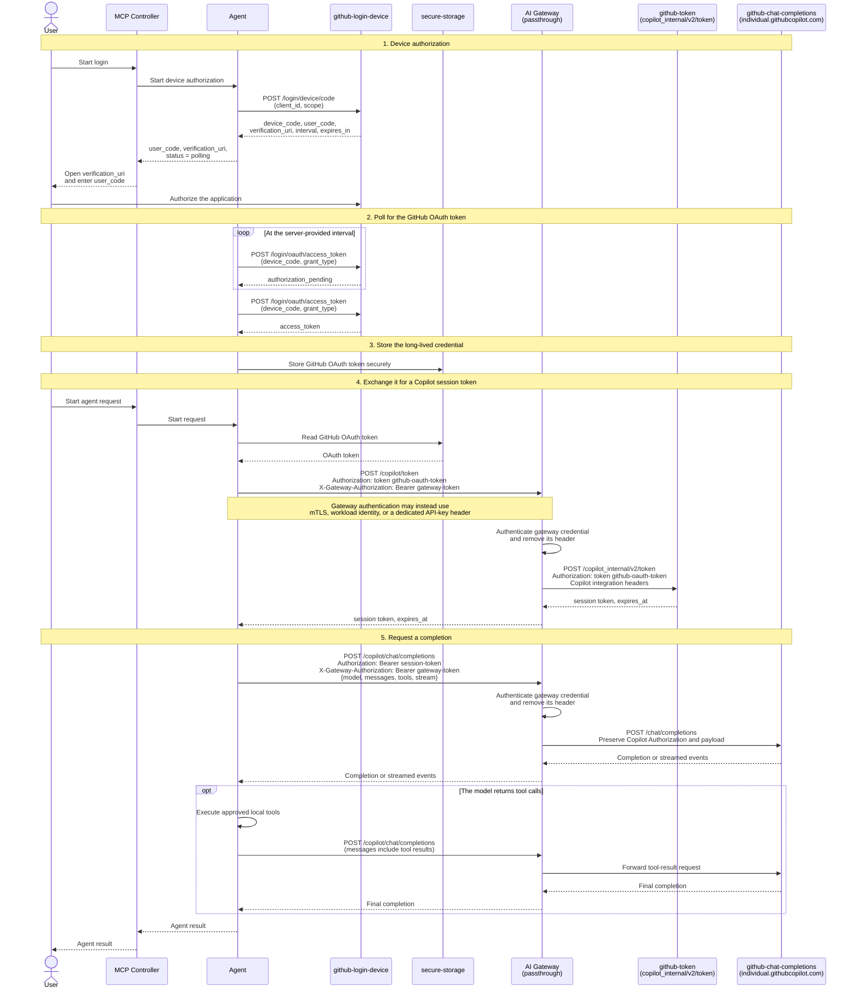

# GitHub Copilot Login and Token Flow

## Overview

This document describes a generic client architecture that authenticates a user with GitHub Copilot through the OAuth Device Authorization Grant, exchanges the resulting GitHub OAuth token for a short-lived Copilot session token, and calls the Copilot chat completions API through a passthrough AI Gateway.

The GitHub Copilot token and chat endpoints shown here are internal service endpoints rather than a stable public API contract. Header requirements, token formats, and endpoint behavior can change. Keep them configurable and validate them against the client integration you operate.

## Actors

| Actor | Responsibility |
|---|---|
| **User** | Authorizes the GitHub application and starts an agent request. |
| **MCP Controller** | Exposes login and agent operations to the user and relays them to the agent. |
| **Agent** | Runs the device flow, stores credentials, exchanges tokens, calls the model, and executes local tools. |
| **github-login-device** | GitHub Device Authorization endpoints: `github.com/login/device/code` and `github.com/login/oauth/access_token`. |
| **secure-storage** | OS keychain, secret manager, encrypted file, or another protected store for the long-lived GitHub OAuth token. |
| **github-token** | GitHub Copilot token exchange endpoint: `api.github.com/copilot_internal/v2/token`. |
| **AI Gateway** | Passthrough gateway that protects, routes, limits, and observes token-exchange and inference traffic without changing the Copilot protocol. |
| **github-chat-completions** | GitHub Copilot chat completions endpoint: `api.individual.githubcopilot.com/chat/completions`. |

## Sequence diagram



## Flow details

### 1. Device authorization

The client asks GitHub for a device code using its registered OAuth client ID and required scopes. GitHub returns a user code, verification URI, device code, polling interval, and expiration time. The user opens the verification URI and authorizes the application.

Device authorization goes directly to GitHub. It does not need to pass through the AI Gateway unless an organization has a separate network-egress requirement.

### 2. Polling

The agent polls `github.com/login/oauth/access_token` at the interval returned by GitHub. It must handle `authorization_pending`, `slow_down`, expiry, denial, and network failures according to the Device Authorization Grant. On success, GitHub returns an OAuth access token.

### 3. Secure token storage

Store the GitHub OAuth token in an OS keychain, managed secret store, or encrypted application store. Do not write it to source-controlled configuration, command history, traces, or application logs. Restrict access to the process that performs token exchange.

### 4. Copilot token exchange

The agent sends the stored GitHub OAuth token to the gateway route for token exchange. The gateway maps that route to:

```text
https://api.github.com/copilot_internal/v2/token
```

The upstream request includes the GitHub credential and the Copilot integration headers required by the client integration, for example:

```http
Authorization: token <github-oauth-token>
Copilot-Integration-Id: <integration-id>
Editor-Version: <editor-version>
Editor-Plugin-Version: <plugin-version>
User-Agent: <client-user-agent>
```

The response contains a Copilot session token and its expiry. Cache the session token only until the returned expiry, refresh it shortly before expiry, and synchronize refreshes so concurrent requests do not trigger a token-exchange burst.

### 5. Chat completions and tool calls

The agent sends chat requests to the gateway route for completions. The gateway maps that route to:

```text
https://api.individual.githubcopilot.com/chat/completions
```

The upstream request carries the short-lived Copilot session token:

```http
Authorization: Bearer <copilot-session-token>
Content-Type: application/json
```

The body contains the model, message history, optional tool definitions, and the stream preference. If the model returns tool calls, the agent validates and executes approved tools locally, appends the tool results to the conversation, and makes another completion request.

For streamed responses, the gateway must preserve status, headers, event ordering, chunk boundaries where practical, and connection lifetime. It must not buffer the full response before forwarding it.

## Security and operational invariants

- Treat the GitHub OAuth token and Copilot session token as secrets.
- Never log `Authorization`, gateway credentials, device codes, or response bodies that may contain sensitive prompts or tool results.
- Authenticate gateway callers independently from the upstream Copilot credential.
- Allowlist the two upstream hosts, paths, and required HTTP methods. Do not expose an open forward proxy.
- Remove gateway-only credentials before forwarding the request upstream.
- Preserve Copilot integration headers and response status codes.
- Disable response caching for token exchange and completions.
- Apply rate limits by trusted client identity, not by the upstream Copilot token.
- Preserve Server-Sent Events or chunked streaming when `stream` is enabled.
- Set explicit connect, idle, and total timeouts that accommodate long-running streamed responses.

## Passthrough configuration notes

### Note 1 of 4 — Use two authentication channels

A gateway-protected request needs two independent credentials:

```http
X-Gateway-Authorization: Bearer <gateway-token>
Authorization: Bearer <copilot-session-token>
```

For token exchange, the second line becomes `Authorization: token <github-oauth-token>`. The gateway validates `X-Gateway-Authorization` and removes it before forwarding the request. mTLS, workload identity, or an API key in a dedicated header are also valid gateway-authentication channels.

Do not configure both the gateway and GitHub Copilot to consume the same `Authorization` header. If organizational policy requires gateway OAuth in `Authorization`, place the upstream credential in a trusted temporary header such as `X-Upstream-Authorization`; after gateway authentication, remove both external headers and reconstruct the upstream `Authorization` header. Reject client-supplied duplicates and overwrite rather than append headers to prevent credential smuggling.

### Note 2 of 4 — LiteLLM Proxy

LiteLLM provides `pass_through_endpoints` with `path`, `target`, `methods`, `forward_headers`, `include_subpath`, `timeout`, and optional endpoint `auth` settings. A minimal routing configuration is:

```yaml
general_settings:
  pass_through_request_timeout: 600
  pass_through_endpoints:
    - path: /copilot/token
      target: https://api.github.com/copilot_internal/v2/token
      methods: [POST]
      include_subpath: false
      forward_headers: true
      auth: false

    - path: /copilot/chat/completions
      target: https://api.individual.githubcopilot.com/chat/completions
      methods: [POST]
      include_subpath: false
      forward_headers: true
      auth: false
```

In this layout, put LiteLLM behind an ingress or service mesh that authenticates with mTLS or a dedicated gateway header, removes that header, and blocks direct access to LiteLLM. This avoids a collision with LiteLLM master-key authentication, which conventionally uses `Authorization`.

`forward_headers: true` is broad. At the ingress, allowlist the Copilot headers and remove cookies, proxy credentials, tracing baggage that must not leave the trust boundary, and hop-by-hop headers. Confirm streaming behavior with an end-to-end `stream: true` request; do not add a buffering ingress policy. See the [LiteLLM pass-through endpoint documentation](https://docs.litellm.ai/docs/proxy/pass_through).

### Note 3 of 4 — WSO2 API Manager

Configure WSO2 gateway authentication to use a header other than `Authorization`. At API level, the WSO2 OpenAPI extension can name the gateway authorization header:

```yaml
x-wso2-auth-header: X-Gateway-Authorization
```

Clients then send the WSO2 OAuth token in `X-Gateway-Authorization` and the GitHub or Copilot token in `Authorization`. Publish separate resources or APIs for `/copilot/token` and `/copilot/chat/completions` because they target different upstream hosts. Remove `X-Gateway-Authorization` before the backend call and preserve the Copilot integration headers.

WSO2 API Manager uses its non-blocking PassThrough transport for API traffic. Keep the completion flow in passthrough mode: avoid mediation policies that build or transform the message body, and verify that transport-header filtering preserves `Authorization`, `Copilot-Integration-Id`, `Editor-Version`, `Editor-Plugin-Version`, and `User-Agent`. If the deployment filters these headers, configure `[apim.transport_headers]` or an equivalent request mediation policy for the installed WSO2 version, then redeploy the API. See WSO2's documentation for [customizing the authorization header](https://github.com/wso2/docs-apim/blob/master/en/docs/api-security/runtime/api-authentication/secure-apis-using-oauth2-tokens.md) and the [PassThrough transport](https://github.com/wso2/docs-apim/blob/master/en/docs/install-and-setup/setup/advance-configurations/changing-the-default-transport.md).

### Note 4 of 4 — Apigee

Use an Apigee credential location that does not consume the upstream `Authorization` header. For example, attach a `VerifyAPIKey` policy to the request PreFlow:

```xml
<VerifyAPIKey name="Verify-Gateway-Key">
  <APIKey ref="request.header.X-Gateway-Key"/>
</VerifyAPIKey>
```

After verification, remove `X-Gateway-Key` with an `AssignMessage` policy. Define two `TargetEndpoint` configurations and select them with conditional `RouteRule` entries: one for `api.github.com/copilot_internal/v2/token` and one for `api.individual.githubcopilot.com/chat/completions`. Leave the upstream `Authorization` header unchanged.

Apigee buffers payloads by default. Enable streaming in both the `ProxyEndpoint` and chat `TargetEndpoint` definitions:

```xml
<Properties>
  <Property name="request.streaming.enabled">true</Property>
  <Property name="response.streaming.enabled">true</Property>
</Properties>
```

Avoid payload-transforming policies on the streaming flow, remove the gateway API-key header before routing, and redact both authentication channels from trace and analytics data. See the Apigee documentation for [`VerifyAPIKey`](https://cloud.google.com/apigee/docs/api-platform/reference/policies/verify-api-key-policy), [conditional routes](https://cloud.google.com/apigee/docs/api-platform/fundamentals/understanding-routes), and [request and response streaming](https://cloud.google.com/apigee/docs/api-platform/develop/enabling-streaming).
